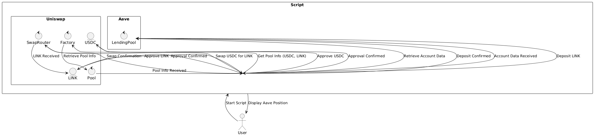

---

# DeFi Script: Uniswap and Aave Integration

## Overview of Script

This script demonstrates the integration and composability of multiple DeFi protocols by executing a series of transactions that involve Uniswap and Aave. The script accomplishes the following:

1. **Swap USDC for LINK on Uniswap:**
   - The user initiates the script to swap a specified amount of USDC for LINK tokens using Uniswap V3.
   - The script interacts with the Uniswap contracts to perform the swap, including approving the USDC for the swap, retrieving the necessary pool information, and executing the swap.

2. **Supply LINK to Aave:**
   - After successfully swapping USDC for LINK, the script approves the LINK tokens for deposit into the Aave lending protocol.
   - The script then deposits the LINK tokens into the Aave lending pool, allowing the user to earn interest on their deposited assets.

3. **Retrieve and Display Aave Position:**
   - The script fetches the user's account data from Aave to display the current position, including the deposited LINK and the accrued interest.

### Explanation

1. **User Interaction:**
   - The user starts the script and specifies the amount of USDC they wish to swap for LINK.

2. **Uniswap Interaction:**
   - The script approves USDC for the swap.
   - It retrieves pool information from Uniswap and performs the swap from USDC to LINK.
   - Upon successful swap, the script approves the LINK tokens for Aave.

3. **Aave Interaction:**
   - The script deposits the swapped LINK into Aave.
   - It then retrieves the user’s position from Aave, including the deposited LINK and any accrued interest.

4. **Display Position:**
   - Finally, the script displays the user's current position on Aave.

## Diagram Illustration

The following diagram illustrates the sequence of steps and interactions between the protocols:

---
